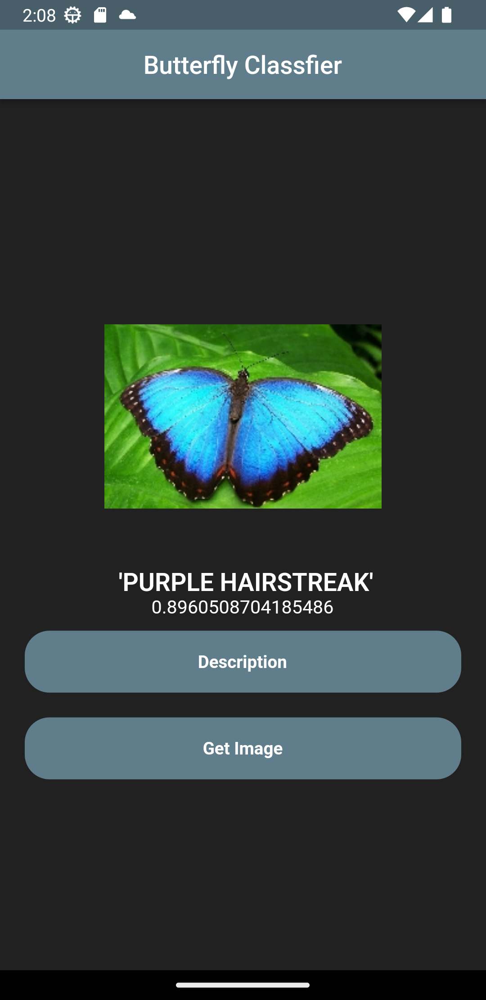

# Flutter Butterfly Classifier

## Features

-   TFlite implementation for butterfly classifications
-   Palm Api implementation for generate butterfly description

## Screenshots

## Supported Butterfly Species

-   'PAPER KITE'
-   'LARGE MARBLE'
-   'JULIA'
-   'GREY HAIRSTREAK'
-   'CLEOPATRA'
-   'AMERICAN SNOOT'
-   'RED POSTMAN'
-   'CLODIUS PARNASSIAN'
-   'PAINTED LADY'
-   'RED ADMIRAL'
-   'ORANGE OAKLEAF'
-   'SOOTYWING'
-   'GREAT JAY'
-   'EASTERN COMA'
-   'EASTERN DAPPLE WHITE'
-   'BROWN SIPROETA'
-   'ATALA'
-   'ZEBRA LONG WING'
-   'QUESTION MARK'
-   'GREEN CELLED CATTLEHEART'
-   'MONARCH'
-   'CLOUDED SULPHUR'
-   'INDRA SWALLOW'
-   'APPOLLO'
-   'PINE WHITE'
-   'COMMON BANDED AWL'
-   'CRECENT'
-   'GREAT EGGFLY'
-   'YELLOW SWALLOW TAIL'
-   'WOOD SATYR'
-   'CHESTNUT'
-   'SCARCE SWALLOW'
-   'COPPER TAIL'
-   'DANAID EGGFLY'
-   'BLUE MORPHO'
-   'AN 88'
-   'METALMARK'
-   'ORANGE TIP'
-   'CHECQUERED SKIPPER'
-   'ADONIS'
-   'IPHICLUS SISTER'
-   'PIPEVINE SWALLOW'
-   'TROPICAL LEAFWING'
-   'STRAITED QUEEN'
-   'MALACHITE'
-   'MESTRA'
-   'BLUE SPOTTED CROW'
-   'SILVER SPOT SKIPPER'
-   'VICEROY'
-   'PEACOCK'
-   'AFRICAN GIANT SWALLOWTAIL'
-   'BANDED ORANGE HELICONIAN'
-   'GOLD BANDED'
-   'CRIMSON PATCH'
-   'BECKERS WHITE'
-   'ORCHARD SWALLOW'
-   'PURPLISH COPPER'
-   'ULYSES'
-   'MANGROVE SKIPPER'
-   'RED CRACKER'
-   'PURPLE HAIRSTREAK'
-   'BANDED PEACOCK'
-   'MILBERTS TORTOISESHELL'
-   'EASTERN PINE ELFIN'
-   'CABBAGE WHITE'
-   'COMMON WOOD-NYMPH'
-   'SOUTHERN DOGFACE'
-   'POPINJAY'
-   'MOURNING CLOAK'
-   'TWO BARRED FLASHER'
-   'SLEEPY ORANGE'
-   'ELBOWED PIERROT'
-   'BLACK HAIRSTREAK'
-   'RED SPOTTED PURPLE'
-   'CAIRNS BIRDWING'
